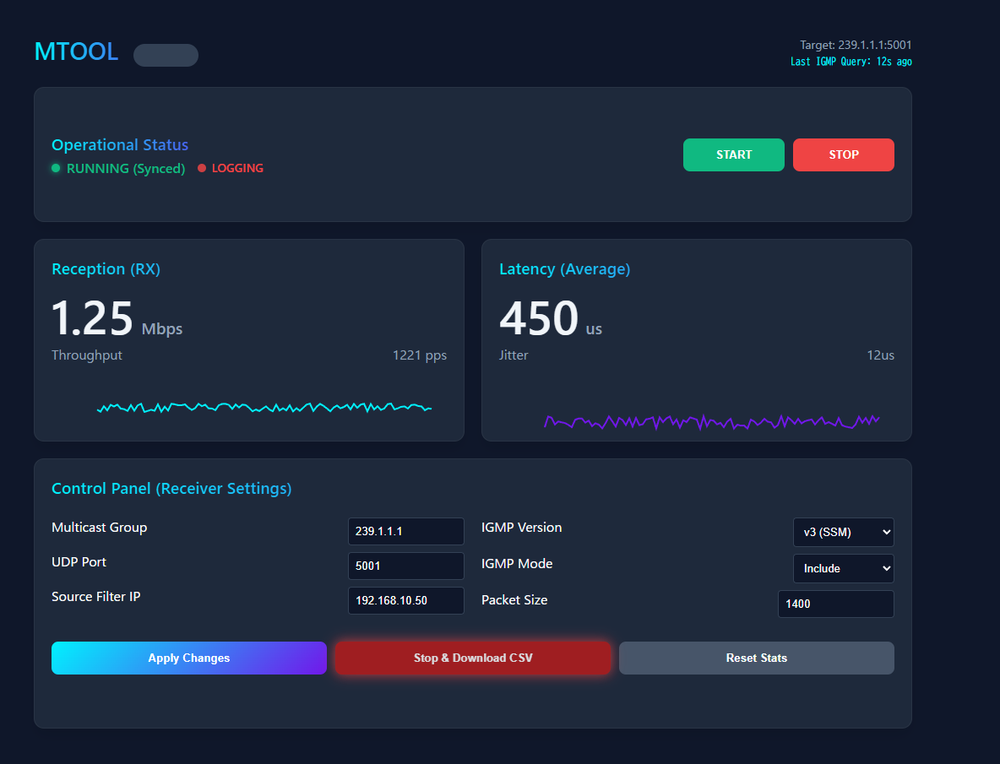
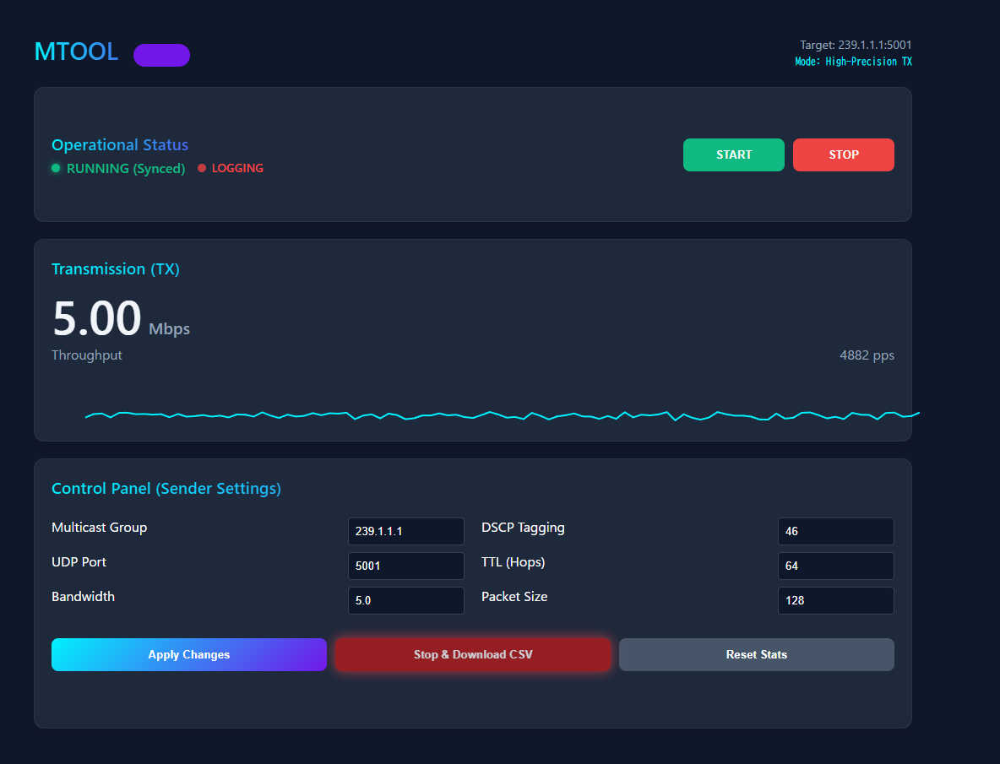

# MTOOL - High-Performance Multicast Testing & Analysis Tool

### Receiver Mode


### Sender Mode


MTOOL is a professional, high-precision network utility designed for testing and analyzing IP Multicast traffic. It provides a real-time web-based dashboard for monitoring throughput, latency, jitter, and packet quality across modern network infrastructures.

## Key Features

- **High-Precision Transmission**: Sub-millisecond packet scheduling for steady-state bandwidth testing.
- **Real-time Analytics**: Live charts for Throughput (Mbps/PPS), Latency (μs), and Jitter.
- **Protocol Analysis**: Detects IGMP queries, actual DSCP tagging, TTL, and IP fragmentation.
- **Multicast Group Support**: Full support for IGMP v2 (ASM) and IGMP v3 (SSM - Source Specific Multicast).
- **Session Logging**: Capture detailed performance statistics to CSV for offline analysis and reporting.
- **Modern Web UI**: Interactive, dark-mode dashboard with glassmorphism aesthetics.

## Quick Start

### Prerequisites
- **Windows OS**
- **Npcap** (with "WinPcap API-compatible mode" enabled)
- **Administrator Privileges** (required for raw socket operations)

### Building the Project
If you have the .NET Framework 4.0 (standard on most Windows systems) installed, you can compile MTOOL using the provided compiler:

```powershell
%SystemRoot%\Microsoft.NET\Framework\v4.0.30319\csc.exe /nologo /target:exe /out:bin\mtool.exe src\mtool.cs src\MToolCore.cs src\AppState.cs src\NetworkEngine.cs src\WebDashboard.cs
```

### Running MTOOL
1. Launch `bin\mtool.exe` as **Administrator**.
2. Select your network interface from the list.
3. Access the dashboard via your browser (the tool will automatically open it for you).

## Directory Structure
- `src/`: Core source code (C#)
- `tests/`: Unit test suite and verification scripts
- `bin/`: Compiled binaries
- `assets/`: UI resources, screenshots, and icons
- `docs/`: Technical documentation and history

## Resources
- **Application Icon**: A high-resolution icon is available in `assets/icon.png`.
  > [!TIP]
  > To embed this icon into the executable, convert it to `.ico` format and add `/win32icon:assets\icon.ico` to the `csc` command during compilation.

## License
© 2026 Mono-Gen. All rights reserved.
